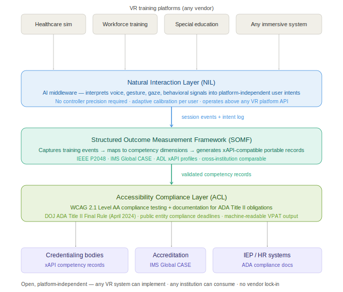
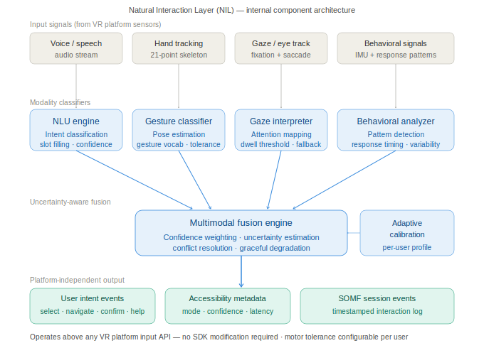
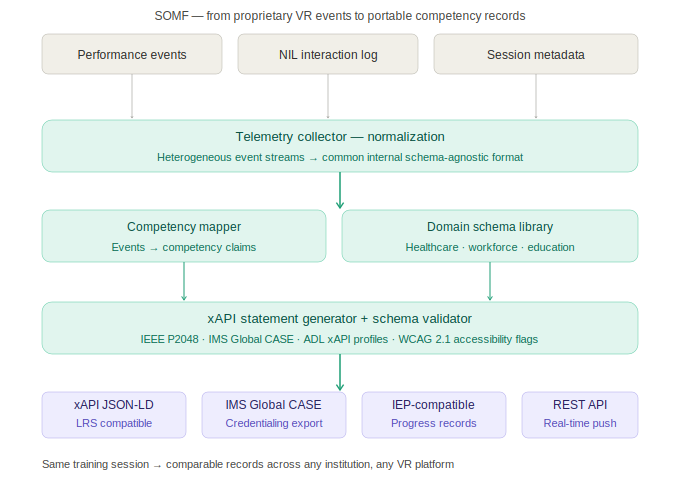

# Open Immersive Training Evaluation Framework
## Technical Architecture — Working Paper v0.1

**Author:** Shivam Mittal | Staff Machine Learning Engineer, Meta Platforms (independent research)  
**Repository:** github.com/shmittal-UF/immersive-training-eval-framework  
**Status:** Working Paper v0.1 — circulated for expert review and feedback  
**Last updated:** May 2026

---

## The Problem

Every VR training system deployed in U.S. hospitals, community colleges, and workforce programs today produces performance data in a proprietary format tied to one vendor's internal schema. When an institution finishes a VR-based clinical simulation or workforce training session, the outcome data generated cannot be:

- Compared against results from a different VR platform
- Submitted to a credentialing body as evidence of competency
- Integrated into the institution's HR or accreditation reporting systems
- Used by researchers at other institutions to validate findings

Additionally, most VR training systems require a level of controller precision, sensory tolerance, and sustained motor coordination that users with motor impairments, autism, and sensory processing differences cannot reliably provide — limiting institutional adoption across special education, healthcare, and workforce training programs serving diverse populations.

This framework proposes open, platform-independent infrastructure to address both gaps.

---

## Framework Overview

The framework consists of three connected, independently implementable components forming a middleware layer between any VR training platform and any institutional output system.



*Figure 1 — System architecture: NIL, SOMF, and ACL sit between VR platforms and institutional systems. Any VR platform can implement the input layer; any institution can consume the output layer.*

### Component Summary

| Component | Function | Standards |
|---|---|---|
| **NIL** — Natural Interaction Layer | Interprets multimodal user intent (voice, gesture, gaze, behavioral) without requiring controller precision | W3C XR Accessibility User Requirements |
| **SOMF** — Structured Outcome Measurement Framework | Captures training events, maps to competency dimensions, generates portable records | xAPI (ADL), IMS Global CASE, IEEE P2048 |
| **ACL** — Accessibility Compliance Layer | Tests WCAG 2.1 Level AA compliance, generates ADA Title II conformance documentation | WCAG 2.1 Level AA, DOJ ADA Title II (April 2024) |

---

## Component 1: Natural Interaction Layer (NIL)

### Design Goal

Enable users to interact with immersive training systems through voice, natural hand movement, gaze, and behavioral cues — rather than requiring precise controller input. The NIL operates above any VR platform's input API without requiring SDK modification or proprietary integration.

### Component Architecture



*Figure 2 — NIL processes four input modalities through individual classifiers into a Bayesian fusion engine. Adaptive calibration adjusts per-user tolerance bands. Output is platform-independent intent events consumed by both the VR system and the SOMF session log.*

### Technical Specification

**NLU Engine**
- Speech recognition with domain-specific vocabulary (clinical, technical, procedural)
- Intent classification: `select`, `navigate`, `confirm`, `cancel`, `help`, `repeat`
- Slot filling for parameterized commands: `"navigate to [location]"`, `"select [option]"`
- Calibrated confidence scores with uncertainty quantification

**Gesture Classifier**
- Landmark-based hand pose estimation (21-point hand skeleton)
- Gesture vocabulary: point, select, grab, release, dismiss, swipe
- Temporal sequence modeling for gesture phrases
- Configurable tolerance bands for motor variability accommodation

**Gaze Interpreter**
- Fixation detection and attention region mapping
- Dwell-time thresholding with configurable parameters
- Saccade filtering to distinguish intentional gaze from visual scanning
- Fallback selection when gaze confidence falls below threshold

**Multimodal Fusion Engine**
- Bayesian fusion of intent signals across modalities
- Conflict resolution when modalities produce contradictory intents
- Graceful degradation when one modality is unavailable or unreliable
- High-confidence intents execute immediately; low-confidence intents request confirmation

**Adaptive Calibration**
- 30-second per-session baseline calibration (optional; defaults available)
- Persistent user profile storage across sessions
- Tolerance band adjustment for users with motor variability
- No calibration required for first-time users (default tolerance parameters)

### NIL Output Schema

```json
{
  "timestamp": "2026-05-30T14:23:11.342Z",
  "intent": "select",
  "target": "option_B",
  "modalities_used": ["gaze", "voice"],
  "confidence": 0.91,
  "uncertainty": 0.09,
  "accessibility_mode": "gaze_primary",
  "session_event_id": "evt_0042",
  "motor_tolerance_band": 0.35
}
```

### Reference Implementation

```python
from nil_framework import NILSession, ModalityConfig

session = NILSession(
    audio_stream=platform.get_audio_stream(),
    hand_tracking=platform.get_hand_tracker(),
    eye_tracking=platform.get_eye_tracker(),
    config=ModalityConfig(
        primary_modality="voice",
        fallback_chain=["gesture", "gaze"],
        motor_tolerance_band=0.35  # 0=strict, 1=maximum tolerance
    )
)

@session.on_intent
def handle_intent(event):
    platform.execute(event.intent, event.target)
    somf_session.log_event(event)
```

---

## Component 2: Structured Outcome Measurement Framework (SOMF)

### Design Goal

Generate standardized, portable competency records from any VR training session that external credentialing bodies, accreditation systems, and institutional HR workflows can consume — without vendor-specific parsing or platform-dependent integration.

### Data Flow



*Figure 3 — SOMF transforms proprietary VR event streams through normalization, competency mapping, and xAPI generation into portable institutional records. The same training session produces records readable by any institution regardless of which VR platform generated them.*

### xAPI Statement Schema

```json
{
  "id": "stmt_7f2a9c",
  "timestamp": "2026-05-30T14:45:00Z",
  "actor": {
    "objectType": "Agent",
    "account": {
      "homePage": "https://institution.edu/lrs",
      "name": "learner_anonymized_id"
    }
  },
  "verb": {
    "id": "https://w3id.org/xapi/adl/verbs/demonstrated",
    "display": {"en-US": "demonstrated"}
  },
  "object": {
    "id": "https://somf.framework/competencies/clinical/iv-insertion",
    "definition": {
      "name": {"en-US": "IV Insertion — peripheral venous access"},
      "type": "https://adlnet.gov/expapi/activities/performance",
      "extensions": {
        "somf:domain": "clinical_simulation",
        "somf:competency_framework": "nursing_clinical_skills_v2",
        "somf:accessibility_mode": "gaze_primary"
      }
    }
  },
  "result": {
    "score": {"scaled": 0.84, "raw": 84, "min": 0, "max": 100},
    "success": true,
    "duration": "PT8M32S",
    "extensions": {
      "somf:attempts": 2,
      "somf:task_completion_sequence": [
        "prep", "site_selection", "insertion", "securement"
      ],
      "somf:error_events": ["insertion_angle_deviation"],
      "somf:nil_modalities": ["voice", "gaze"]
    }
  },
  "context": {
    "platform": "somf_v0.1",
    "extensions": {
      "somf:vr_platform": "platform_anonymized",
      "somf:schema_version": "somf_clinical_v1.0",
      "somf:institution": "institution_anonymized",
      "somf:accessibility_compliance": "wcag_2_1_aa"
    }
  }
}
```

### Domain Schema Library

Domain schemas are configurable JSON-LD documents mapping VR events to competency dimensions. Three reference schemas are in development:

**Healthcare schema** — maps clinical simulation events to:
- ACGME milestone competencies
- NCLEX-RN competency frameworks  
- SSH (Society for Simulation in Healthcare) assessment standards

**Workforce schema** — maps procedural training events to:
- DOL O\*NET occupational competency definitions
- Enabling portable workforce readiness documentation for credentialing bodies

**Education schema** — maps learning activity events to:
- IMS Global CASE competency frameworks
- IEP measurable goal progress indicators (IDEA-compliant)

### Reference Implementation

```python
from somf_framework import SOMFSession, Schema

session = SOMFSession(
    schema=Schema.load("healthcare/clinical_simulation_v1"),
    lrs_endpoint="https://your-lrs.institution.edu/xapi/",
    institution_id="institution_anonymized"
)

session.attach(platform.event_stream)

# On session complete
records = session.export(format="xapi")
# Also available: "ims_case", "csv", "iep_progress", "rest_api"
```

---

## Component 3: Accessibility Compliance Layer (ACL)

### Design Goal

Enable VR training systems to document compliance with WCAG 2.1 Level AA accessibility standards as required by the DOJ ADA Title II Final Rule (89 Fed. Reg. 31,320, April 24, 2024), which establishes compliance deadlines of April 26, 2026 for larger public entities and April 26, 2027 for smaller ones.

### WCAG 2.1 Evaluation for Immersive Environments

The ACL extends standard WCAG 2.1 test procedures with immersive-environment-specific criteria identified in the W3C XR Accessibility User Requirements:

| WCAG Criterion | Standard Test | Immersive Extension |
|---|---|---|
| 1.3.3 Sensory Characteristics | Color independence | Spatial audio alternative; non-color spatial cues |
| 2.1.1 Keyboard | Keyboard navigable | NIL alternative input pathway documented |
| 2.4.3 Focus Order | Tab focus order | 3D spatial focus traversal sequence |
| 2.5.1 Pointer Gestures | Single-point alternative | Gaze/voice alternative for multi-point gestures |
| 3.3.1 Error Identification | Error text | Audio error notification + spatial indicators |

### ACL Output

```python
from acl_framework import ACLEvaluator

evaluator = ACLEvaluator(
    system=your_vr_system,
    wcag_level="AA",
    include_immersive_extensions=True
)

report = evaluator.run()
report.export_vpat("compliance_report.pdf")        # VPAT format
report.export_machine_readable("compliance.json")  # machine-readable
```

---

## Standards Alignment

| Standard | Role |
|---|---|
| xAPI (Experience API) — ADL | SOMF output data transport format |
| IMS Global CASE | Competency framework interoperability |
| IEEE P2048 | VR/AR standards alignment target |
| WCAG 2.1 Level AA | ACL compliance baseline |
| W3C XR Accessibility User Requirements | ACL immersive extension basis |
| DOJ ADA Title II Final Rule (April 2024) | ACL compliance obligation context |
| IDEA (Individuals with Disabilities Education Act) | Education schema IEP alignment |

---

## Current Status

```
[x] System architecture defined
[x] xAPI output schema specified
[x] WCAG 2.1 immersive extension criteria identified
[x] Healthcare competency schema — draft complete
[x] Architecture diagrams published
[ ] NIL reference implementation (Python) — in progress
[ ] SOMF reference implementation (Python + Node) — in progress
[ ] ACL test protocol runner — in progress
[ ] Workforce and education schema drafts
[ ] Pilot evaluation at V-ARE Lab, University of Illinois Chicago — in discussion
[ ] Pilot evaluation at Rising Star SPED Academy, San Jose CA — in discussion
```

---

## Collaboration

Active research discussions with:
- **Dr. Mohan Zalake**, V-ARE Lab, University of Illinois Chicago — healthcare simulation evaluation methodology
- **Rising Star SPED Academy**, San Jose, CA — accessibility-focused education pilot

For research collaboration or feedback on this working paper, contact: [your email]

---

## License

Framework specification: [Creative Commons CC-BY 4.0](https://creativecommons.org/licenses/by/4.0/)  
Reference implementations (when released): Apache 2.0

---

*Working Paper v0.1 — May 2026 | github.com/shmittal-UF/immersive-training-eval-framework*
